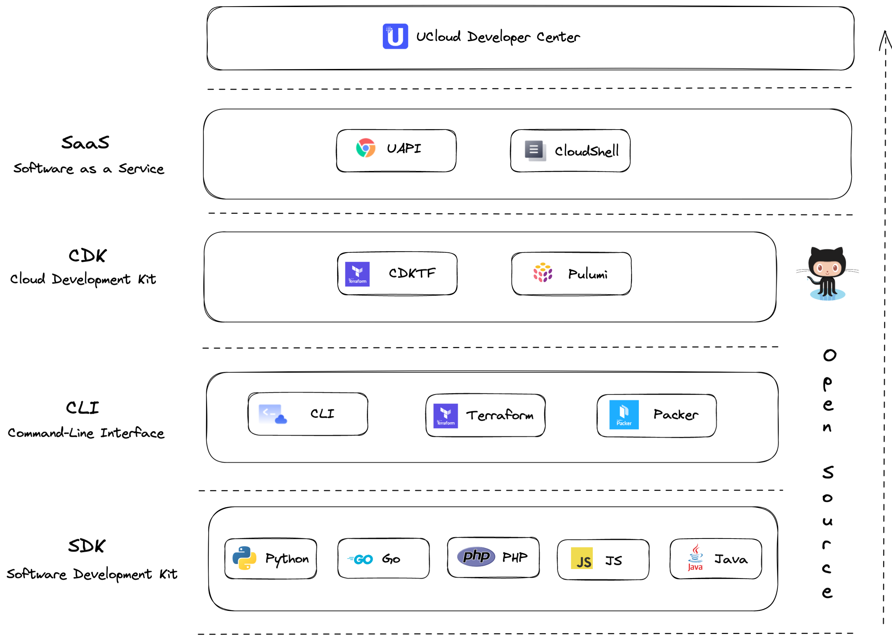

# UCloud Developer Tools

**[WIP]: Working in Progress**

UCloud is a cloud vendor in China. We provide many developer tools to help users manage cloud resources.

## Table of Content

- [Landscape](#Landscape)
- [Introduction](#Introdution)
- Concept
  - [Imperative vs Declarative vs Interactive](./concept/architectureal-style.md)
  - [Code Generation Pipeline](./concept/code-generation-pipeline.md)
- Culture
  - [Open Source and Gift Culture](./culture/open-source.md)
  - [SLA for Community](./culture/sla-for-community.md)
- [Contribution Guideline](#Contribution)
- [Proposals](./proposals)
- [Design Documentations](./design)
- Roadmap

## Landscape

UCloud has developed and contributed to many open-source tools.

## Introdution

| Categories | Name             | Hosted by | Style       | Homepage (Chinese)                                     | Repository                                                   |
| ---------- | ---------------- | --------- | ----------- | ------------------------------------------------------ | ------------------------------------------------------------ |
| Landing    | Developer Center | Self      | Interactive | ~                                                      | ~                                                            |
| SaaS       | UAPI             | Self      | Interactive | [Doc](https://docs.ucloud.cn/uapi/README)              | ~                                                            |
| SaaS       | CloudShell       | Self      | Interactive | [Doc](https://docs.ucloud.cn/cloudshell/README)        | ~                                                            |
| CDK        | CDKTF            | Community | Declarative | ~                                                      | ~                                                            |
| CDK        | Pulumi           | Community | Declarative | ~                                                      | ~                                                            |
| CLI        | CLI              | Self      | Mixed       | [Doc](https://docs.ucloud.cn/cli/README)               | [Github](https://github.com/ucloud/cli)                      |
| CLI        | Terraform        | Community | Declarative | [Doc](https://docs.ucloud.cn/terraform/README)         | [Github](https://github.com/ucloud/terraform-provider-ucloud) |
| CLI        | Packer           | Community | Declarative | [Doc](https://docs.ucloud.cn/uhost/guide/image/packer) | [Github](https://github.com/hashicorp/packer/blob/master/website/content/docs/builders/ucloud-uhost.mdx) |
| SDK        | Go               | Self      | Imperative  | [Doc](https://docs.ucloud.cn/opensdk-go/)              | [Github](https://github.com/ucloud/ucloud-sdk-go)            |
| SDK        | Python           | Self      | Imperative  | [Doc](https://docs.ucloud.cn/opensdk-python/)          | [Github](https://github.com/ucloud/ucloud-sdk-python3)       |
| SDK        | Java             | Self      | Imperative  | [Doc](https://docs.ucloud.cn/opensdk-java/)            | [Github](https://github.com/ucloud/ucloud-sdk-java)          |
| SDK        | PHP              | Self      | Imperative  | [Doc](https://docs.ucloud.cn/opensdk-php/)             | [Github](https://github.com/ucloud/ucloud-sdk-php)           |
| SDK        | JS/TS            | Self      | Imperative  | [Doc](https://docs.ucloud.cn/opensdk-js/)              | [Github](https://github.com/ucloud/ucloud-sdk-js)            |

## Contribution

UCloud developer tools is an collection of open source tools. We will publish my design and roadmap into this repository.

If you have any proposal for our tools, create an issue for free. We will convert the major inspire as an proposal draft, and push it forward.

When any proposal done, it will be convert as a design documentation. You can see all the documentation at here.
