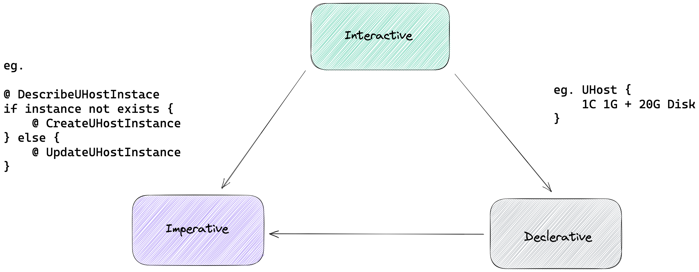

# Architectural Styles

Under normal circumstances, the services provided by cloud service providers to users often consist of these three types of user interfaces:

1. **Imperative** (Imperative) APIs and tools **use verbs to describe how to operate a specific resource**, such as creating a virtual machine instance, turning it on, and shutting it down. Popular API architecture styles such as RESTFul and Action are instances of imperative APIs.
2. **Declarative** (Declarative) APIs and tools **only need to describe what the expected resource looks like**. The specific actions to be performed are automatically completed by the tool or platform. For example, Kubernetes Operator, Terraform, etc., the tool itself often needs to compare the difference between the current actual resource state and the expected state, so tools can automatically make decisions and execute a series of orchestration logic.
3. **Interactive** (Interactive) tools **based on a series of interactive design**, step by step **close to the user's goal**. For example: API debugger can allow users to continuously modify parameters and initiate requests until they get the results they want.

Then these three types of architectural styles are essentially abstracts of the question of "**How ​​to make the target system converge to a state that meets expectations** according to the user's intentions". Related research includes [Mark Burgess](https://en.wikipedia.org/wiki/Mark_Burgess_(computer_scientist))'s work on *[Configurable immunity for evolving human-computer systems](https://www.sciencedirect.com/science/article/pii/S0167642303000479/pdf?md5=46dcfcb349f21d4d1ffb4525aac49f61&pid=1-s2.0-S0167642303000479-main.pdf)*, and a series of related projects implemented by Puppet, Hashicorp, CNCF and other organizations.

UCloud's developer tools are based on imperative APIs and build higher-level user interfaces based on it, and the developer tool is automatically constructed through the [code generation pipeline](./code-generation-pipeline.md).
