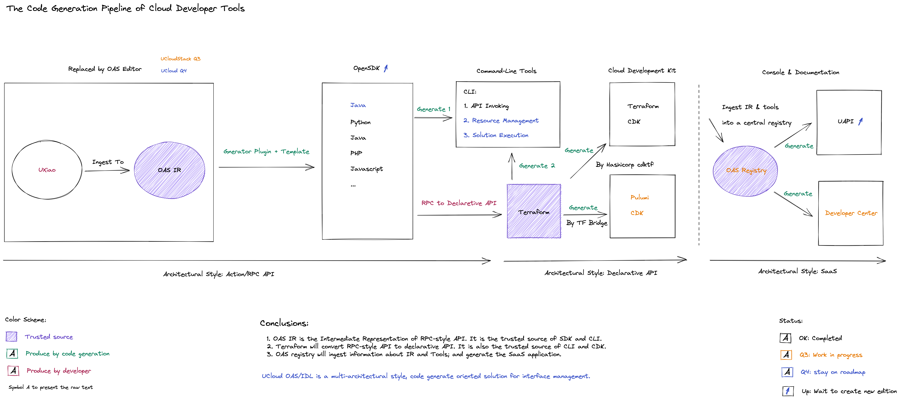

# Code Generation Pipeline

UCloud uses **code generation** technology on a large scale of developer tools development.

According to Martin Fowler's definition in *[Domain-Specific Languages](https://martinfowler.com/books/dsl.html)*, the code generation strategy includes code generation based on **transformer** and **template**.

- The **transformer-based** method means to use general programming languages ​​such as Go and Python for text processing, which is more flexible.
- The **template-based** method means generate code by writing a template DSL because the template has a structure similar to the target code, so it is more human-readable.

In the practice of code generation, UCloud **supports two-generation strategies at the same time**.

- The transformer is used for **model to model generation**: such as construction of domain model of semantic. For example, the document center needs additional navigation information, and the converter obtains this information from an external system and performs the semantic model transformation.
- The template is used for **model to code generation**, such as the Markdown document in the document center. After the applicable scenarios are clarified, the responsibilities of the associated team can be made more explicit. The writing cost of the template is lower than the transformer so that non-R&D teams can also make the design and modification of the template, which greatly improves the engineering efficiency.

Below is a figure of the code generation pipeline.

The red text in the figure represents the part that needs to be edited/developed, and the green text describes the code generation workflow.

1. After the product teams **edited the API document**. We convert it into a standardized **intermediate representation** by a series of internal developer tools.
2. The SDK/CLI is generated based on the intermediate representation. At this stage, the delivery of the imperative (Imperative) API is completed
3. The developer-tools team, writing **API reconciliation (Reconcile) logic**, convert the imperative API to declarative API
4. Based on the declarative API, build the Terraform cloud provider plugin and generate CDK tools
5. Finally, extract all tool information into a **persistent storage**, and expose it to SaaS applications and developer tools for use

The above steps are the automated code generation pipeline for developer tools. The orange text in the figure indicates the tools waiting to be released, and the blue text shows the features in the Q4 roadmap. The status and roadmap of all tools can be obtained in Github.

Software delivery based on the code generation pipeline optimizes the construction cost of tools from `M*N` to `M+N`, and at the same time, clarifies responsibilities. It is also resolved the challenge of cost efficiency of cloud developer tools.
